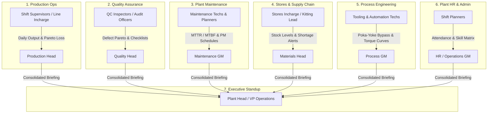

# Product Design Document (`design_doc.md`)
**Bajaj Manufacturing Federated Command Center & Executive Intelligence System**

**Status:** APPROVED  
**Target Client:** Bajaj Auto Ltd. (Engine Assembly & Manufacturing Plants)  
**Date:** 2026-08-29  
**Mode:** Enterprise B2B Manufacturing Execution & Intelligence  

---

## 1. Executive Summary & Problem Statement

### 1.1 The Operational Problem at Bajaj
In high-throughput automotive engine assembly lines, hundreds of engines move across multiple stations every shift (`Block Assembly` $\rightarrow$ `Piston Sub-Assy` $\rightarrow$ `Cylinder Head` $\rightarrow$ `Torque Tightening` $\rightarrow$ `Dyno Firing` $\rightarrow$ `FQC Inspection`). 

Telemetry and operational logs are generated continuously across PLCs, torque controllers, Poka-Yoke sensors, and manual checklists. Historically, this data lived in isolated silos.

### 1.2 The Status Quo Pain Point
Every morning between **7:00 AM and 8:30 AM**, shift supervisors and department engineers endure a **45 to 90-minute scramble**:
- Exporting raw CSV dumps from multiple SCADA terminals.
- Manually compiling VLOOKUP tables in Excel to compute Plan vs. Actual and MTTR/MTBF.
- Screenshotting charts and pasting them into PowerPoint/PDF for the **Plant Head’s 8:30 AM morning standup**.
- When production misses quota by 150 engines, the meeting devolves into cross-departmental finger-pointing (Production blames Machine Breakdowns; Maintenance blames Part Shortages; Quality blames Operator Error).

### 1.3 The Core Solution
A **Federated Manufacturing Command Center** that serves two distinct operational tiers:
1. **Interactive Shop-Floor Tier (Supervisors & Engineers)**: Real-time telemetry monitoring, bottleneck drill-downs, defect filtering, and barcode UID genealogy tracking.
2. **Executive Briefing Tier (Department Heads & Plant Head)**: Standardized **1-Click Multi-Tab Excel (.xlsx)** and **Print-Ready 1-Page PDF** briefings delivered before the morning standup.

---

## 2. Target Personas & Departmental Matrix



---

## 3. Detailed Departmental Modules & Feature Matrix

### Module 1: Production Management (`/production`)
- **Primary Audience**: Line Supervisors $\rightarrow$ Production Head.
- **Key Metrics**: Total Production, Production Shortfall, Current WIP Buffer, Rollover Plan, Straight-Pass (First-Time-Right) %.
- **Visuals**:
  - Composed Bar + Step-Line Chart (Hourly Target vs. Actual completions).
  - Shortfall Pareto Chart (Ranked loss causes: Machine Breakdown, Material Shortage, Quality Hold, Setup Delay).
  - SKU & Model-wise table with status badges.
- **Executive Export**: Multi-sheet XLSX (`KPI Summary`, `Hourly Plan vs Actual`, `Pareto Loss`, `SKU Breakdown`).

### Module 2: Performance & OEE (`/performance`)
- **Primary Audience**: Industrial Engineers $\rightarrow$ Operations Director.
- **Key Metrics**: Overall Equipment Effectiveness (OEE), Overall Line Efficiency (OLE), Availability %, Performance %, Quality %.
- **Visuals**:
  - Half-Circle Pie Gauges for 4 core efficiency metrics.
  - Stacked Bar Charts: Operational Run-Time vs. Unscheduled Downtime.
  - Production & Labor Cost Trend lines.

### Module 3: Process Monitoring (`/process`)
- **Primary Audience**: Automation Engineers $\rightarrow$ Technical Lead.
- **Key Metrics**: Total Poka-Yoke Checks, OK vs. NOT-OK cycles, Bypass Event Counts & Durations.
- **Features**:
  - **Poka-Yoke Interlocking**: Real-time sensor gate tracking.
  - **Bypass Event Audit Log**: Mandatory capture of Bypass Start/End Time, Station ID, Operator, Reason, and Approving Supervisor.
  - **Torque Tightening Curves**: Peak torque (Nm) and angle verification against min/max specification limits.
  - **Conveyor Health**: Stoppage durations and motor fault tracking.

### Module 4: Track & Trace (Genealogy) (`/trace`)
- **Primary Audience**: Quality Auditors, Traceability Officers $\rightarrow$ Compliance Head.
- **Key Metrics**: Serialized Engine Barcode UID Search (`ENG-2026-XXXXX`).
- **Features**:
  - Full Station-by-Station genealogy history with timestamps, operators, and OK/NOK status.
  - WIP Buffer Pipeline monitoring to identify station bottlenecks.
  - Engine-Wise Rework History & Defect Clearance logging.

### Module 5: Quality Module (`/quality`)
- **Primary Audience**: QC Inspectors $\rightarrow$ Quality General Manager.
- **Key Metrics**: Defect Count, Defect Rate (PPM), Right-First-Time (RFT) %.
- **Features**:
  - Categorized Defect Distribution (Cosmetic, Mechanical, Leakage, Pressure Vessel, Torque).
  - Standardized Digital Checklists: **IQC** (Incoming), **IPQC** (In-Process), and **FQC** (Final Dyno/Strip Audit).
  - PQCA (Process Quality Control Audit) compliance scoring.

### Module 6: Maintenance Management (`/maintenance`)
- **Primary Audience**: Maintenance Engineers $\rightarrow$ Plant Engineering Head.
- **Key Metrics**: Machine Status (`Running`, `Breakdown`, `Maintenance`, `Idle`), Total Downtime (mins), Breakdown Occurrences, MTBF (hrs), MTTR (mins), Machine Availability %.
- **Features**:
  - Top 7 Breakdown Pareto Analysis.
  - MTTR & MTBF Equipment Reliability Metrics and Downtime Summaries.
  - *(Note: Preventive Maintenance (PM) is managed in dedicated plant CMMS software).*

### Module 7: Material & Kitting (`/material`)
- **Primary Audience**: Stores Incharge, Kitting Leads $\rightarrow$ Supply Chain Head.
- **Key Metrics**: Material Availability %, Shortage Count, Line-Feed Health, Pending Material Requests.
- **Features**:
  - Stock Level Distribution: **Critical** ($< \text{Min Stock}$), **Safe**, and **Excess**.
  - Kitting Station Efficiency & Kit Inspection pass rates.
  - BOM (Bill of Materials) vs. Actual consumption tracking.

### Module 8: Workforce Allocation (`/workforce`)
- **Primary Audience**: Shift Supervisors $\rightarrow$ Plant HR & Operations Lead.
- **Key Metrics**: Operators Assigned vs. Present, Absenteeism %, Skill Match %, Station Utilization %, Overtime Hours.
- **Features**:
  - Station-wise line balancing matrix.
  - Operator Competence & Certification matching for high-risk assembly stages.

---

## 4. The "Single Source of Truth" Causal Chain

When a shift misses production quota, the dashboard mathematically links the root causes across departments:

```
[Production Shortfall: -150 Engines]
       │
       ├── 60% caused by: [Maintenance: ST-02 Conveyor Motor Breakdown (45 min)]
       ├── 25% caused by: [Process: ST-04 Torque Tool Sensor Bypass (20 min)]
       └── 15% caused by: [Material: M8 Flange Bolt Shortage in Kit-101]
```

**Result**: Eliminates subjective arguments during morning management reviews; every failure is backed by verified machine timestamps.

---

## 5. Technical Architecture & Export Pipeline

### 5.1 Technology Stack
- **Frontend**: React 18, Vite, Tailwind CSS, Recharts (SVG data visualizations), Framer Motion, Lenis (Smooth momentum scrolling).
- **Backend API**: Node.js, Express.js (Port 5000), `mssql` + `msnodesqlv8` (Windows Authentication).
- **Database Schema**: `PPMS_BajajPant` on Microsoft SQL Server (Plant modeling, Line configuration, Work-in-Progress, Defect logs, Hourly OLE).
- **Deterministic Simulation Engine**: Multi-tier scaling (`Shift` = 0.015, `Day` = 0.03, `Week` = 0.25, `Month` = 1.0) allowing offline demonstrations and standalone UI testing.

### 5.2 Reporting & Export Architecture
1. **Multi-Sheet XLSX Workbook Generation (`exportToXLSX`)**:
   - Tab 1: `KPI Summary` (Aggregated shift/period metrics).
   - Tab 2: `Time-Series Trends` (Hourly / daily data points).
   - Tab 3: `Detailed Event Logs` (Row-level incident and inspection records).
2. **Print / PDF Engine**:
   - Custom `@media print` CSS rules automatically hide navigation sidebars, headers, and UI controls, scaling charts to standard A4/Letter dimensions for crisp vector PDF export via native browser print (`Ctrl + P`).

---

## 6. Success Metrics & Value Delivery

| Metric | Status Quo (Manual) | Target with Command Center |
| :--- | :--- | :--- |
| **Morning Report Prep Time** | 45 – 90 minutes per shift lead | **< 10 seconds (1-click export)** |
| **Data Discrepancy Arguments** | Frequent (siloed spreadsheets) | **0 (Unified SQL single source of truth)** |
| **Poka-Yoke Bypass Visibility** | Delayed (paper logbooks) | **Immediate / Real-time audit log** |
| **MTTR / MTBF Calculation** | Weekly manual calculation | **Real-time automated computation** |
| **Critical Part Stockout Warning** | Post-facto line stoppage | **Proactive threshold alert** |

---

## 7. Immediate Action Item ("The Assignment")

**For the next customer review with Bajaj Management:**
1. Do not demo all 25 screens sequentially.
2. Conduct a **5-minute roleplay walkthrough**:
   - Show how the **Shift Lead** clicks `Shift 1` $\rightarrow$ hits **`Excel`** $\rightarrow$ hands the 1-page PDF briefing to the **Plant Head**.
   - Show how the **Quality Head** inspects the **Defect Pareto** and drills into an engine barcode UID in **Genealogy**.
   - Show how the **Maintenance Head** validates **MTTR/MTBF** and checks breakdown root causes.

---
