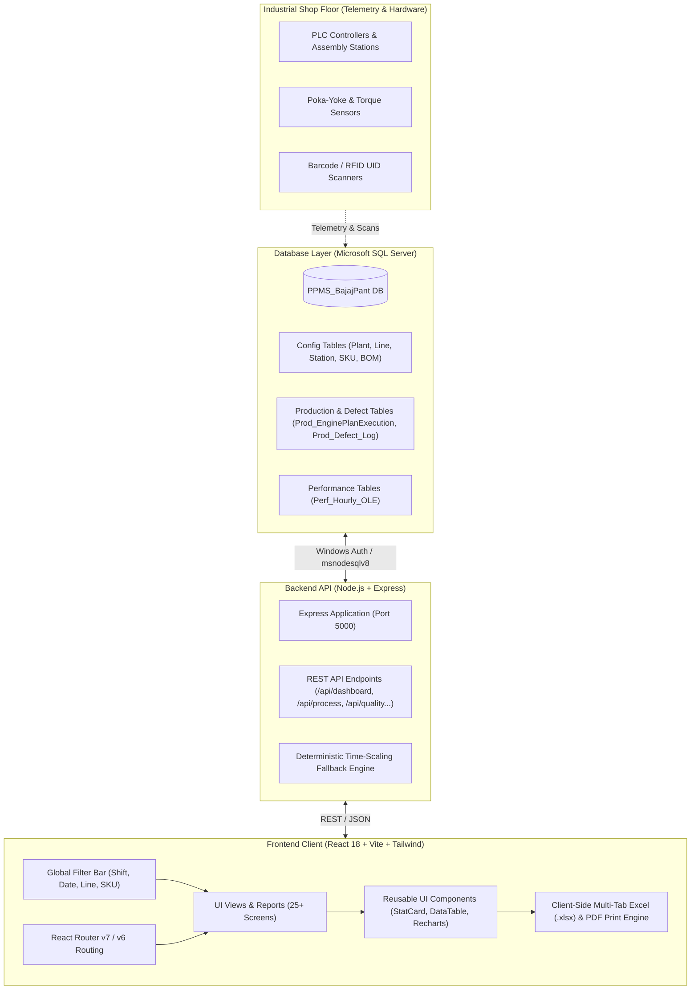
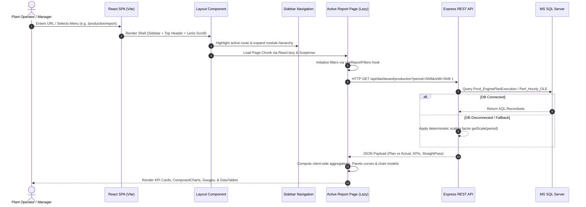
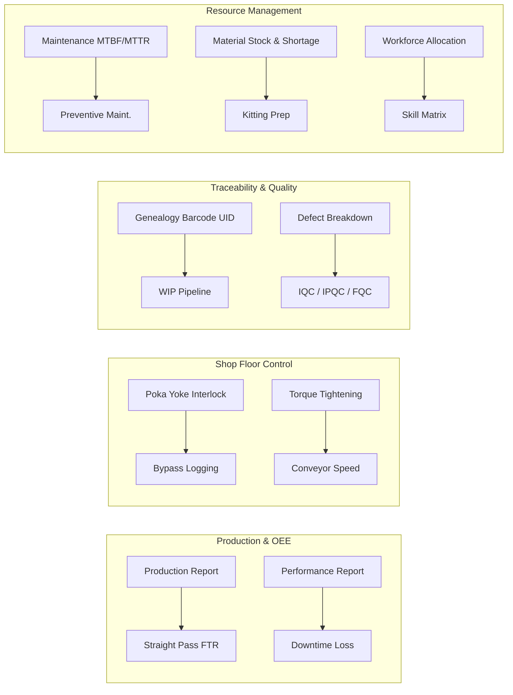
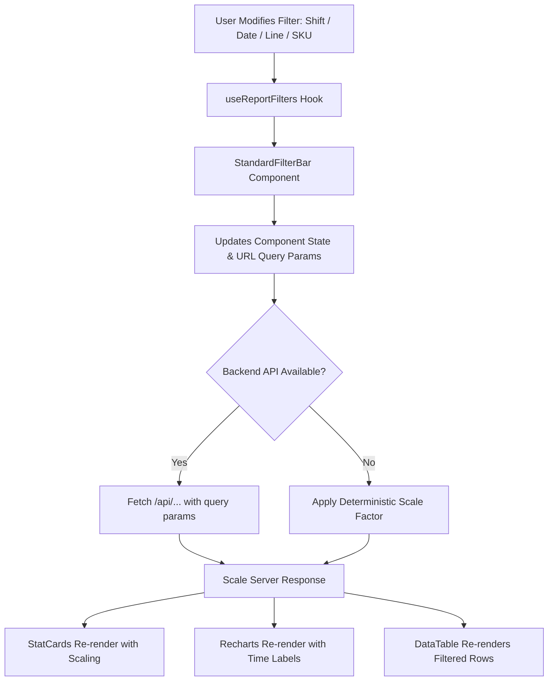

# System Architecture & Flow Document (`flow.md`)
**Bajaj Manufacturing Execution & Intelligence Dashboard**

---

## 1. Executive Summary & Application Overview

The **Bajaj Manufacturing Dashboard** is an enterprise-grade Manufacturing Execution System (MES) intelligence web application engineered for high-volume automotive engine assembly and production plants (e.g., Bajaj Auto). 

The platform aggregates real-time and historical telemetry across **8 major manufacturing domains**:
1. **Production Management**: Plan vs. Actual tracking, Shift/Hourly yields, Shortfall Pareto analysis, and Straight-Pass / First-Time-Right (FTR) metrics.
2. **Performance (OEE) Management**: Overall Equipment Effectiveness (OEE), Overall Line Efficiency (OLE), Availability, Performance, and Runtime vs. Downtime breakdowns.
3. **Process Monitoring**: Poka-Yoke interlocking, Bypass event auditing, Torque angle/tightening verification, and Conveyor stoppage metrics.
4. **Track & Trace**: Serialized engine genealogy (barcode UID tracking), Work-in-Progress (WIP) buffer tracking, and Engine-wise rework logging.
5. **Quality Assurance**: Defect classification, Pareto defect drilldowns, Process Quality Control Audits (PQCA), and standard checklists (IQC, IPQC, FQC).
6. **Maintenance Operations**: Breakdown logs, Mean Time Between Failures (MTBF), Mean Time To Repair (MTTR), and Preventive Maintenance (PM) schedules.
7. **Material & Kitting**: Real-time stock status, shortage alerts, bill of materials (BOM) consumption tracking, and kitting station efficiency.
8. **Workforce Allocation**: Shift attendance, station line-balancing, operator skill matrix matching, and idle time / overtime analytics.

---

## 2. High-Level Architecture

The system follows a tiered client-server manufacturing intelligence architecture:

---

## 3. End-to-End Data & Execution Flow

### 3.1 User Navigation & Routing Lifecycle

---

## 4. Module-by-Module Operational Flow

### 4.1 Production Management Flow
1. **Plan vs. Actual Analysis**:
   - `Prod_Shift_Plan` and `Prod_EnginePlanExecution` supply planned engine quota vs. completed count.
   - Recharts `ComposedChart` renders hourly step-line target curves against bar charts of actual completions.
2. **Shortfall & Pareto Loss Calculation**:
   - Shortfall is quantified (`Plan - Actual`).
   - Root causes (Material Shortage, Machine Breakdown, Quality Hold, Setup Delay) are ranked in descending order with cumulative percentage lines (80/20 Pareto rule).
3. **Straight-Pass / First-Time-Right (FTR)**:
   - Tracks engines completing assembly without hitting any rework loop:
     $$\text{Straight Pass Qty} = \text{Completed Qty} - \text{Rework OK Qty}$$

### 4.2 Performance (OEE / OLE) Flow
1. **OEE Metrics Engine**:
   - Overall Equipment Effectiveness is computed from three core pillars:
     $$\text{OEE} = \text{Availability} \times \text{Performance} \times \text{Quality}$$
2. **Gauge Visualizations**:
   - Half-circle pie gauges (`PieChart` with `startAngle={180}` and `endAngle={0}`) visualize real-time percentages for Product Availability, Line Performance, Quality/OLE, and Equipment Efficiency.
3. **Runtime vs. Downtime**:
   - Stacked bar charts break down machine operational run-time against unscheduled downtime per station.

### 4.3 Process Monitoring Flow
1. **Poka-Yoke Interlocking**:
   - Assembly stations feature sensor-gated error proofing (tightening confirmation, component presence).
   - OK vs. NOT-OK (NOK) cycles are plotted hourly.
2. **Bypass Event Auditing**:
   - If an operator or supervisor bypasses a safety/quality gate (e.g. sensor fault), the bypass duration, reason, authorization, and station ID are logged in real-time.
3. **Torque Tightening Curves**:
   - Fastening operations log peak torque (Nm) and angle against minimum/maximum specification limits.
4. **Conveyor Analytics**:
   - Tracks line stoppage durations, motor faults, and line speed variations.

### 4.4 Track & Trace (Genealogy) Flow
1. **Engine UID Genealogy**:
   - Operators scan a barcode UID (e.g., `ENG-2026-00123`).
   - System fetches the full sequential history across all assembly stations (`ST-01 Block Assembly` $\rightarrow$ `ST-02 Piston` $\rightarrow$ `ST-03 Head` $\rightarrow$ `RW-01 Rework`).
2. **Work-In-Progress (WIP) Tracking**:
   - Real-time station buffer monitoring to identify bottlenecks where semi-finished engines accumulate.
3. **Engine-Wise Rework History**:
   - Tracks rework frequency, cycle time spent in rework bays, and defect clearance stamps.

### 4.5 Quality Assurance & Checklists Flow
1. **Defect Categorization**:
   - Captures defect logs (`Prod_Defect_Log`) categorized by Engine Half, Leakage, Pressure Vessel, Cosmetic, and Torque failure.
2. **Standardized Checklists (IQC / IPQC / FQC)**:
   - **IQC (Incoming Quality Control)**: Raw materials & supplier components.
   - **IPQC (In-Process Quality Control)**: Sub-assembly and mid-line checks.
   - **FQC (Final Quality Control)**: Dyno engine firing, strip audit, and final electrical testing.

### 4.6 Maintenance Operations Flow
1. **Equipment Health Monitoring**:
   - Tracks live states across machines: `Running`, `Breakdown`, `Maintenance`, or `Idle`.
2. **MTTR & MTBF Reliability**:
   - **MTBF (Mean Time Between Failures)**: $\frac{\text{Operational Uptime}}{\text{Number of Breakdowns}}$
   - **MTTR (Mean Time To Repair)**: $\frac{\text{Total Downtime}}{\text{Number of Breakdowns}}$
3. **Preventive Maintenance (PM)**:
   - Tracks schedule compliance, lubrication routines, and calendar-based servicing.

### 4.7 Material Management & Kitting Flow
1. **Stock Levels & Safety Buffers**:
   - Identifies items in **Critical** ($< \text{Min Stock}$), **Safe**, or **Excess** zones.
2. **Kitting Operations**:
   - Measures kitting preparation speed, kit inspection pass rates, and synchronization with main assembly line speed.

### 4.8 Workforce Management Flow
1. **Shift Attendance & Skill Balancing**:
   - Compares planned vs. present workforce per station.
2. **Skill Matrix Matching**:
   - Ensures high-criticality stations (e.g., Crankcase Sub-Assy) are manned by certified Skill Level 3/4 operators.

---

## 5. Filter & State Propagation Flow

The user filter interaction operates via a centralized unidirectional flow:

### Deterministic Period Scaling Matrix:
To allow offline demonstration and standalone UI interaction without requiring a live MSSQL instance:
- **Month View**: Base multiplier = `1.000`
- **Week View**: Base multiplier = `0.250`
- **Day View**: Base multiplier = `0.030`
- **Shift View**: Base multiplier = `0.015`

---

## 6. Export & Reporting Flow

1. **Excel Generation (`exportToXLSX`)**:
   - Multi-sheet workbook builder using `xlsx` (SheetJS).
   - Generates worksheets for:
     - `KPI Summary` (Aggregated metrics)
     - `Hourly / Trend Data` (Time-series records)
     - `Detailed Event Logs` (Row-level operational data)
2. **Print & PDF Engine**:
   - Customized CSS print stylesheet (`@media print`) hides navigation sidebars and headers, scales charts to full page width, and enables direct clean vector PDF export via native browser print dialog.

---
